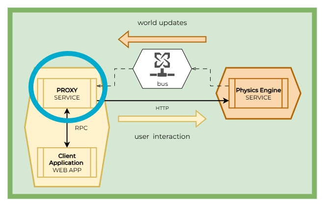
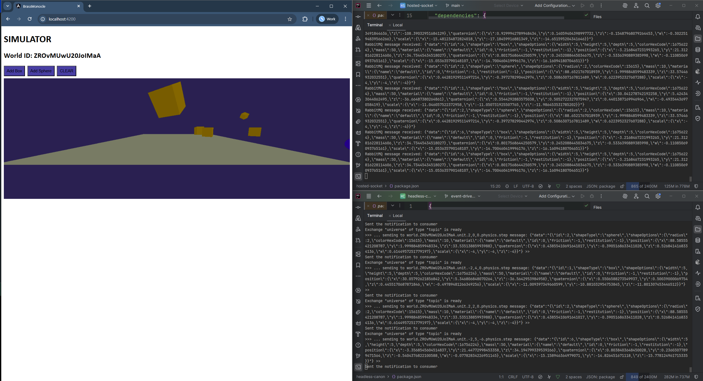
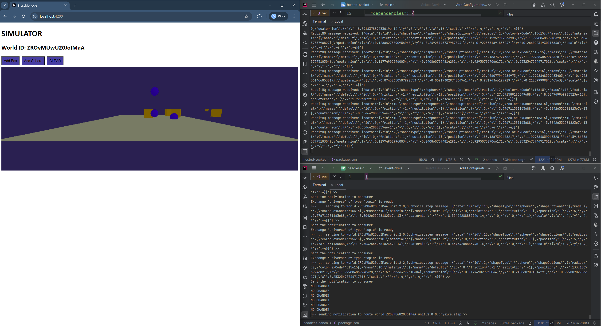

# Hosted Socket - Proxying Messages to an Interactive Virtual World

This project is part 2/3 of a proof-of-concept system that implements a basic real-time loop using a microservices architecture. A microservices architecture is being explored as a means of making Virtual Reality (VR) applications available for cloud-native infrastructure, with a design that is capable of leveraging elastic scaling.

## Quickstart

Clone each of the 3 projects, and run a development server for each of them in the following order:
1. Headless Cannon
2. **Hosted Socket** (👈 you are here)
3. Brass Monocle 

>  Run `npm install`
>
>  Run `npm run dev`

Configuration for the websocket server and message bus consumer can be found here: `websocket-server.ts`

## Architectural Design

You are here 👉🔵

## Preview

